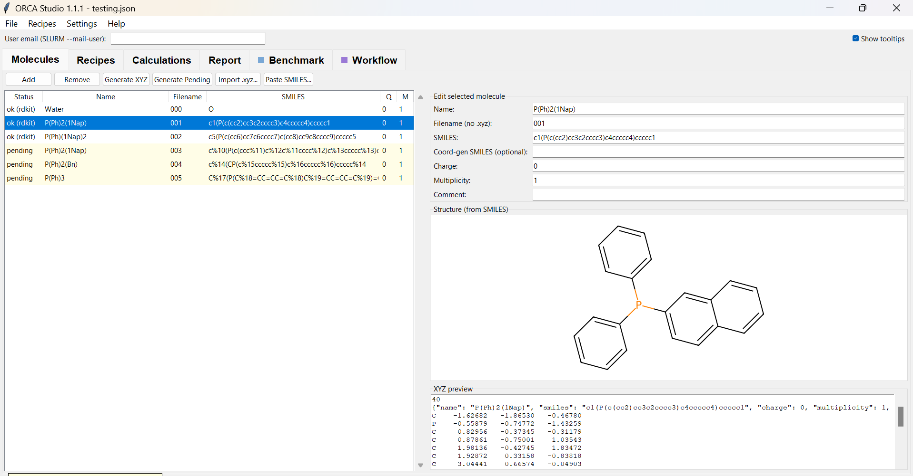

# ORCA Studio

A desktop GUI for building, launching, and monitoring [ORCA](https://www.faccts.de/orca/) quantum-chemistry calculations on a SLURM cluster — from a SMILES string to a submitted job to a plotted IR/NMR spectrum, without leaving the window.

<!-- TODO: add a screenshot of the running app as the first visual.
     Suggested: the Calculations tab mid-run, or the Molecules tab showing a
     structure. Save it as docs/screenshot.png and it will render below. -->


---

## TL;DR

ORCA Studio turns the usual "write an input file, scp it, sbatch it, squeue it, scp the output back, parse it" loop into a tabbed GUI:

- **Draw molecules** from SMILES (RDKit → OpenBabel fallback) or import `.xyz`.
- **Define theory levels** once as reusable recipes (method + basis + variant).
- **Generate and submit** SLURM jobs into a tidy `calcs/<mol>/<category>/<type>/<method>/` tree; derive follow-up calculations (FREQ/NMR/SP) from a finished optimisation in one click.
- **Watch jobs live** — double-click a running job for a self-updating SCF / geometry-convergence plot.
- **Extract results** — energies, geometries, frequencies, NMR shieldings, thermochemistry — into a JSON + CSV report, and plot simulated IR and NMR spectra.
- **Or draw a pipeline** — wire `Molecules → Optimize → Frequencies → Condition → Property → Report` in the Workflow tab and let it build, launch, branch, and resume itself.

It is designed to run **on the cluster login node** and be displayed on your own machine through an X-forwarding SSH client (e.g. MobaXterm), so it calls `sbatch`/`squeue` directly and reads job output straight off the shared filesystem. It **also runs on a normal Windows/Linux/macOS PC** for the build / visualise / report parts (see [Running on a PC](#running-on-a-pc)).

---

## Installation

Both ways are *editable* installs (`pip install -e .`): the command points back at this folder, so the app updates in place whenever you `git pull` — **no reinstall, and don't move the folder afterwards** (that breaks the link).

### On a SLURM cluster (e.g. Lido) — via X-forwarding

Copy/clone this repository somewhere stable (e.g. `/work/<your_id>/orca-studio`), then from the repository root:

```bash
module load python          # REQUIRED — provides numpy's OpenBLAS (see note)
pip install --user -e .
orca-studio                 # launches; the window appears on your PC over X-forwarding
```

> **`module load python` is mandatory on the cluster.** The scientific stack
> (matplotlib → numpy) needs `libopenblas.so`, which that module autoloads.
> Without it the app fails at startup with
> `ImportError: libopenblas.so.0: cannot open shared object file`.
> Put `module load python` in your `~/.bashrc` so you never forget it.

If `~/.local/bin` isn't on your `PATH`, either add it or just launch with `python -m orca_studio`.

### On a Windows PC

No `module load` needed — the Windows wheels bundle their own libraries. From a terminal **opened in this folder** (the one with `pyproject.toml`):

```cmd
py -m pip install --user -e .
py -m orca_studio
```

- Use `py -m pip` (not bare `pip`) so it installs into the Python you actually launch with.
- The `orca-studio` command lands in a per-user `Scripts` folder that often isn't on `PATH`, so **`py -m orca_studio` is the reliable way to launch** (works from anywhere). pip prints that Scripts path during install if you'd rather add it to `PATH`.
- Keep the folder where it is (e.g. in your cloned repo); the editable install points at it.

<details>
<summary>Prefer an isolated virtual environment? (optional)</summary>

```cmd
py -m venv .venv
.venv\Scripts\activate
pip install -e .
python -m orca_studio
```
On Linux/macOS use `source .venv/bin/activate` instead of the second line.
</details>

### Verify the environment

```bash
orca-studio --diagnose      # or: python -m orca_studio --diagnose
```

Reports whether RDKit / OpenBabel can generate coordinates on this machine — run it first if structure generation misbehaves.

Open a saved project straight away:

```bash
orca-studio myproject.json
```

---

## The six tabs

| Tab | What it does |
|-----|--------------|
| **Molecules** | Build 3D structures from SMILES (auto charge/multiplicity, optional "coord-gen SMILES" metal-swap trick), paste a whole list from ChemDraw, see a 2D depiction, double-click to open in Avogadro/molden. |
| **Recipes** | A searchable, sortable, favouritable library of ORCA input templates. A recipe = calc type (OPT/FREQ/NMR/…) + method label + optional variant + the template text. |
| **Calculations** | The job lifecycle in one place: plan calcs, **derive** follow-ups from finished ones (inherits the optimised geometry), build `.inp`/`.slurm`, submit via `sbatch` (or **Run locally** on a PC), refresh status via `squeue` (F5), double-click for a live plot. Right-click a finished FREQ/NMR for a simulated spectrum. |
| **Report** | Pick finished calculations and extractors (energy, geometry, trajectory, frequencies + IR, NMR shieldings, thermochemistry, dipole, HOMO–LUMO) and write a `<name>.json` + flat `<name>.csv` summary. |
| **⚗ Benchmark** | A bulk generator: fan a set of molecules out across many theory levels in a couple of clicks (see note). |
| **🔀 Workflow** | A visual node-graph pipeline editor (KNIME-style): wire `Molecules → Optimize → Frequencies → Condition → Property → Report`, then **Run pipeline** to build, launch, and advance each step automatically — including **conditional branches** (e.g. only run NMR if the FREQ job found no imaginary modes). See [The Workflow tab](#the-workflow-tab) (also evolving). |

> **⚗🔀 The Benchmark and Workflow tabs are newer and still evolving.** Both
> work, but they are the least settled parts of the app and **may change
> substantially in future versions**. Treat them as conveniences, not a stable
> API.

---

## The Workflow tab

The Workflow tab is a visual **node-graph pipeline editor**. Instead of clicking through OPT → derive FREQ → check → derive NMR by hand, you draw the recipe once as a graph and let the app run it.

```
 Molecules ──▶ Optimize ──▶ Frequencies ──▶ Condition ──▶ Property ──▶ Report
                                            (no imag. freq?)   (NMR/SP)
```

Each node is a step; **green ports carry a geometry, orange ports carry results**. You wire an output port to a compatible input port, and the geometry flows down the chain (each calc inherits the optimised geometry of the one before it).

### Node types

- **Molecules** — the source; choose *all* molecules or a specific selection.
- **Optimize / Frequencies / Property (SP/NMR/…)** — calculation steps; pick a recipe on each.
- **Condition** — a gate on the branch below it. It tests the calc feeding it and only lets the branch run if the test passes. Predicates: *no imaginary frequencies* (a true minimum), *has an imaginary frequency* (e.g. a transition state), or *terminated normally*.
- **Report** — collects results. It accepts **multiple inputs**, so several calcs can feed into one merged report.

### Editing the graph

| Action | How |
|--------|-----|
| Add a node | Buttons on the toolbar, **F3** (search at the cursor), or drag a wire into empty space |
| Connect | Drag from an output port onto an input port — or drop on empty space to pick + connect a new node (Blender-style search), or select two nodes and press **J** |
| Move | Drag a node (drags the whole selection if several are selected) |
| Select | Click; **Ctrl+click** to multi-select; **drag a box** in empty space; **Ctrl+A** for all |
| Pan | Middle-drag or right-drag the canvas |
| Context menu | **Right-click** a node/edge/empty space (connect, disconnect, delete, add-here) |
| Delete | Select and press **Delete** |

### Running it

- **Run pipeline** expands the graph across your molecules and runs it live: each step builds and launches as soon as its input geometry is ready, conditions are evaluated the moment their feeding job finishes, and nodes recolour by state (grey = waiting, blue = running, green = done, red = error, purple = skipped, orange = interrupted). It works the same on the cluster (`sbatch`) and on a PC (local ORCA).
- **Generate only** creates the planned calculations and jumps to the Calculations tab without launching, in case you want to review or edit them first.

### Resuming, independent networks, and reports

- **Stop & resume.** If you stop a pipeline (or close the app) and later hit **Run pipeline** again, it *continues* rather than restarting: finished steps are reused, and only the unfinished/interrupted ones run again — no duplicate jobs.
- **Independent networks.** Several disconnected graphs on the same canvas (each with its own Molecules source) expand and run as separate pipelines.
- **Merged report.** When a pipeline finishes, every Report node writes a `<name>.json` + `.csv` to the project root, gathering all the calculations wired into it *plus the optimisation/frequency steps they came from*.
- **Interrupted jobs are flagged.** A job that was running when the app closed is shown as **interrupted** (not stuck on "running") when you reopen the project, and a resume re-runs exactly those.

---

## Running on a PC

Once installed (see [Installation → On a Windows PC](#on-a-windows-pc)), the same app runs on a normal desktop; the cluster-only actions adapt automatically:

- **Run locally** replaces Submit when `sbatch` isn't found: point the app at your local `orca` executable once (remembered in `~/.orca_studio.json`) and it runs the built jobs through a serial queue — one at a time by default — streaming each `.out` so the live plots, reports, and the Workflow pipeline all work just as they do on the cluster. The button label and behaviour switch on their own based on whether `sbatch`/`squeue` are present.
- **Avogadro** opens locally: double-click a molecule, point it at your `Avogadro2.exe` once, and it's remembered in `~/.orca_studio.json`.
- **Coordinate generation, recipes, spectra, and reports** all work the same.

---

## Requirements

- **Python ≥ 3.9** (developed against the cluster's 3.9; avoids 3.10+ syntax).
- **Tkinter** — bundled with most Python builds.
- [`rdkit`](https://www.rdkit.org/) — coordinate generation and 2D depiction (OpenBabel is a fallback).
- [`openbabel-wheel`](https://pypi.org/project/openbabel-wheel/) — fallback coordinate generation.
- [`matplotlib`](https://matplotlib.org/) — live plots and spectra (needs numpy → on a cluster, see the `module load python` note).

All are pulled in automatically by the `pip install -e .` step above (Windows wheels need no compiler).

---

## Project layout

```
ACH-Orca-Studio/
├── pyproject.toml            # package metadata + the `orca-studio` console script
├── requirements.txt
├── orca_studio/
│   ├── __main__.py           # entry point + --diagnose / --help / project-path arg
│   ├── core/                 # pure logic, no GUI (unit-testable)
│   │   ├── coords.py         # SMILES → 3D XYZ (RDKit/OpenBabel), xyz I/O
│   │   ├── inputs.py         # recipes + .inp rendering
│   │   ├── slurm.py          # SLURM script templating
│   │   ├── slurm_runtime.py  # sbatch / squeue wrappers (graceful when absent)
│   │   ├── orca_parser.py    # parse ORCA 6 output (SCF, geometry, freqs, NMR, …)
│   │   ├── reporting.py      # result extractors → JSON + CSV
│   │   ├── spectra.py        # line-broadening math (no numpy needed)
│   │   ├── local_runner.py   # serial local-ORCA job queue (PC mode)
│   │   ├── workflow.py       # node-graph pipeline model + conditional expansion
│   │   ├── project.py        # project.json model (molecules, planned calcs)
│   │   └── config.py         # per-user config (~/.orca_studio.json)
│   ├── ui/                   # Tkinter widgets, one module per tab + helpers
│   └── data/
│       ├── slurm_template.sh # the SLURM submit template
│       └── recipes/*.json    # starter recipe library
└── LICENSE
```

<details>
<summary><b>How it works</b> (click to expand)</summary>

- **The SLURM template** copies the input to the compute node's local `/scratch`, runs ORCA there, and copies results back on exit. ORCA's stdout is wrapped in `stdbuf -oL` so the `.out` on the shared filesystem updates line-by-line *during* the run — that's what makes the live plots possible. The output streams to `<rundir>/<jobname>-<jobid>.out`.
- **Live monitoring** reads that `.out` directly (no SSH, no callbacks) and re-parses it on a timer. The parser is regex-based and was verified against real ORCA 6.0.1 output for OPT, single-point, FREQ, and NMR jobs.
- **Derived calculations** carry a `parent_id` and a `geometry_source` of `parent:<id>`; at build time the child reads the parent's optimised `<mol>.xyz`. A child can't be built until its parent has produced that geometry — a natural gate that mirrors the OPT → confirm → FREQ → SP/NMR workflow.
- **The Workflow pipeline** expands the node graph into ordinary planned calculations (each tagged with its graph node, so re-running *resumes* instead of duplicating). A Condition node attaches a *gate* — `{source, predicate}` — to the calcs below it, and the driver evaluates that predicate on the source job's `.out` the moment it finishes, opening or permanently closing the branch. Because a local job can only be "running" while the app that launched it is alive, reopening a project re-evaluates job state so anything left mid-run reads as *interrupted* rather than stuck on "running".
- **Spectra** are simulated by broadening the parsed stick lines (Lorentzian/Gaussian) — no `orca_mapspc` needed. The NMR window plots several molecules at once and highlights the one a peak belongs to on hover.
- **No outbound network code.** The app never opens a connection; it only calls local `sbatch`/`squeue` and reads local files. Everything reaches your screen through your own X-forwarding SSH client.

</details>

---

## Authorship and AI involvement

This project was conceived and directed by **[@p3rAsperaAdAstra](https://github.com/p3rAsperaAdAstra)** (Christian Nelle). It grew out of his own collection of ORCA/SLURM automation scripts (coordinate generation, input distribution, job launching, and the SLURM template), which embody the workflow and the directory conventions ORCA Studio is built around. Those scripts, the domain expertise, the design decisions, and the testing are his.

The **ORCA Studio application code was written by Claude (Anthropic's AI assistant) at the author's direction**, in May 2026, turning those scripts and the author's design choices into the tabbed GUI documented here. Output-parsing regexes and the workflow logic were validated against real ORCA 6.0.1 calculations during development.

This note is included for transparency about what is human-authored versus AI-authored. Nothing here claims the AI did more or less than it did.

---

## License

MIT — see [LICENSE](LICENSE). © 2026 Christian Nelle, Arbeitsgruppe Prof. Henke, Fakultät für Chemie und Chemische Biologie, Technische Universität Dortmund.
